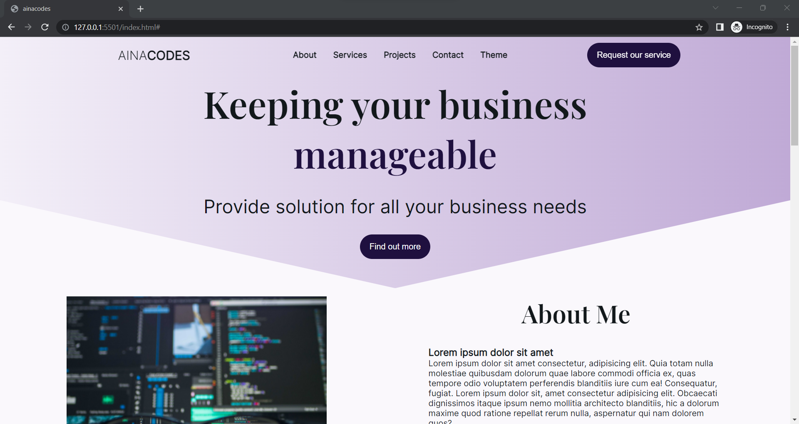
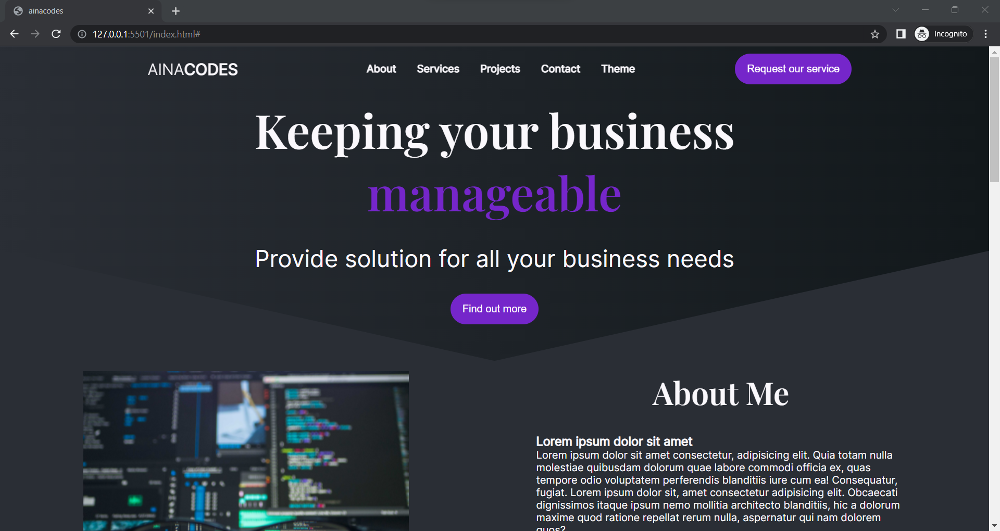

# Responsive Website 

Build with **HTML**, **CSS/ SASS**, and **JavaScripts**
This website was made by referring to the tutorials in the references. 
From that I made some changes according to my needs. 
 
[Click here](https://aina-portfolio-test.netlify.app/) for the demo

# References
* [Build a Responsive SPA Website using HTML & CSS Tutorial](https://youtu.be/XxtxO-5VecQ)
* [CSS Theme Switcher Tutorial](https://youtu.be/rXuHGLzSmSE)
